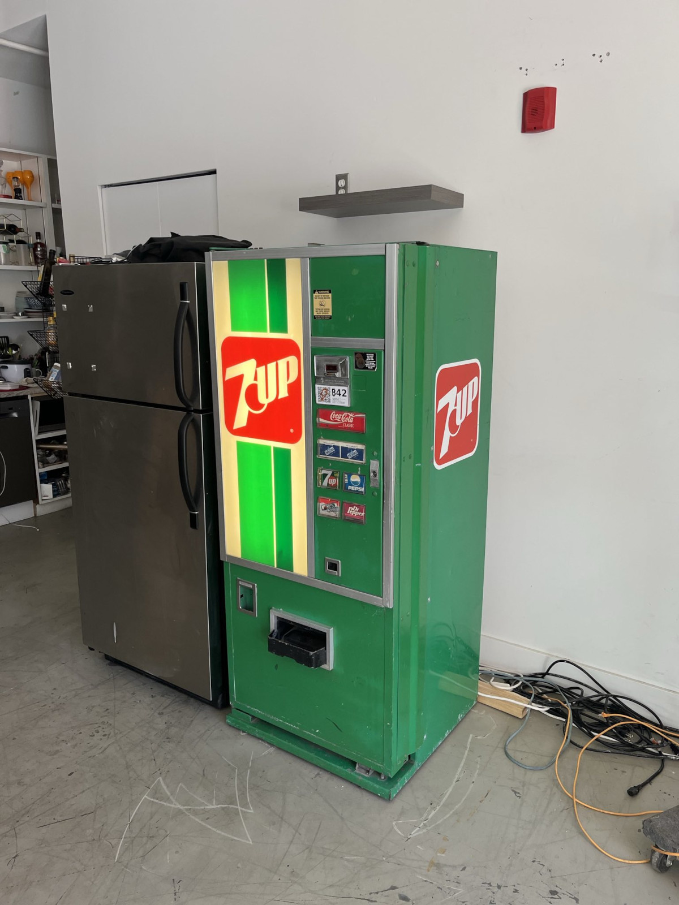

# 21UP

Bitcoin-only fork of DCTRL's infamous [Bepsi Machine](https://github.com/GitYVR/bepsi-pi)

This code lives in the 21UP vending machine and does one thing:

- Accept sats, dispense cans

This guide was written for Debian 12.



## Prerequisites:

`sudo apt install git make build-essential`

Requires [Node.js](https://nodejs.org/en/download)

```bash
curl -o- https://raw.githubusercontent.com/nvm-sh/nvm/v0.40.3/install.sh | bash
\. "$HOME/.nvm/nvm.sh"
nvm install 20
```

Requires [Yarn](https://classic.yarnpkg.com/lang/en/docs/install/#debian-stable)

```bash
npm install --global yarn
```

## Install:

```bash
git clone https://github.com/Liongrass/21UP.git
cd 21UP
yarn
```

Copy the example environment and fill out the parameters:

```bash
cp .env.example .env
nano .env
```

To test run:

```bash
yarn start
```

## Run

To persist 21UP and make it run on startup:

```bash
cd ~/21UP
npm install -g pm2
pm2 start index.js --name 21UP --exp-backoff-restart-delay=100
pm2 startup
```

pm2 will then issue you a command that will generate and install a systemd file for your system. Run this command and restart your machine to test this.

Useful commands:

```bash
pm2 list
pm2 monit
```

To see logs:

```bash
pm2 logs 21UP
```
